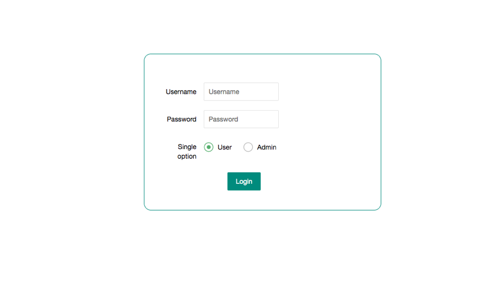
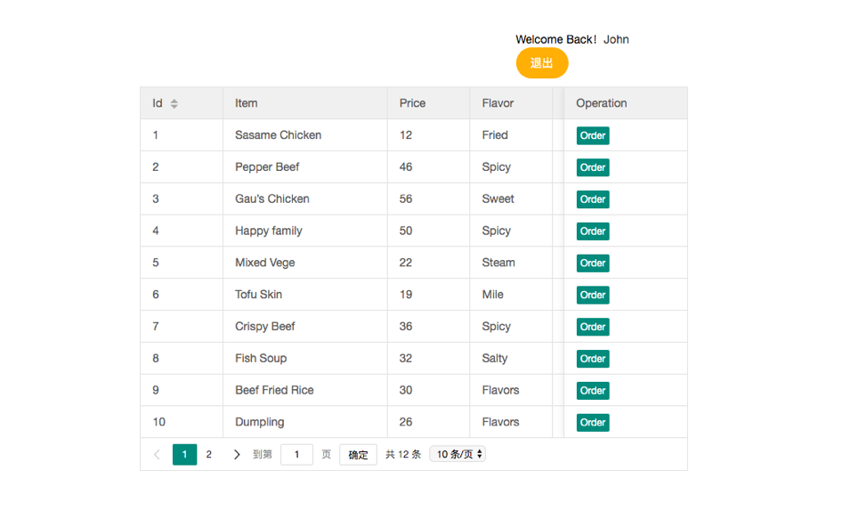
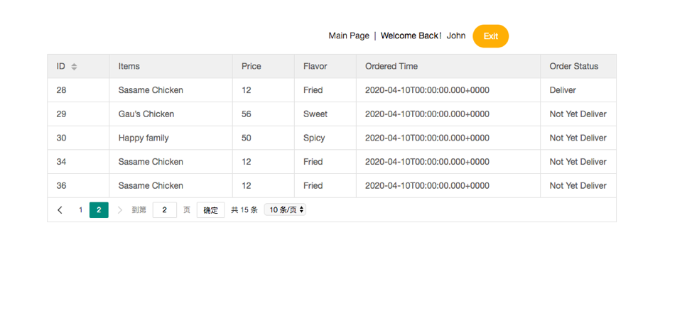
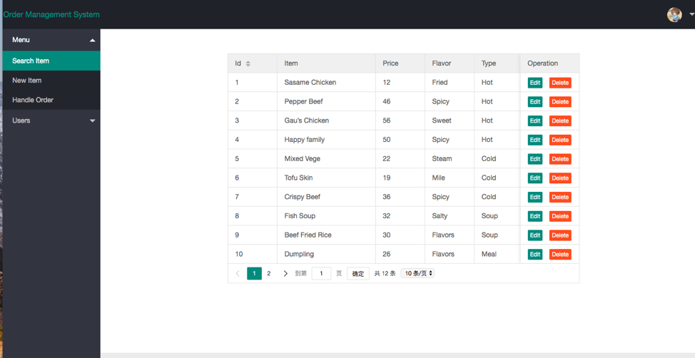
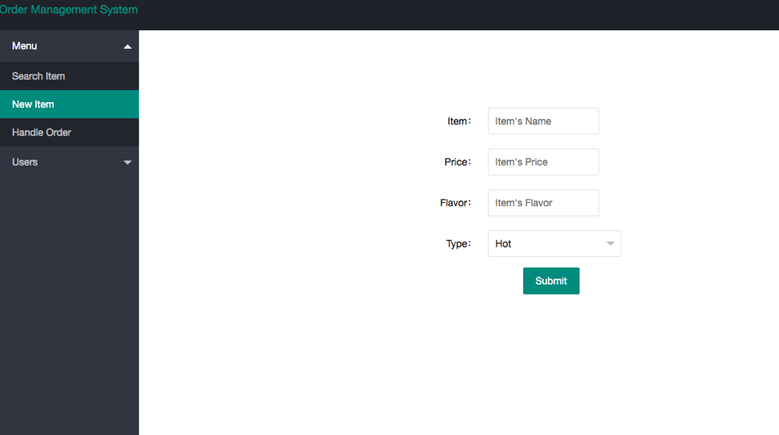
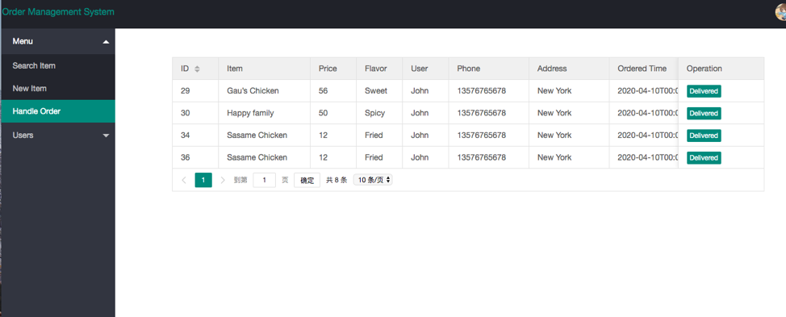
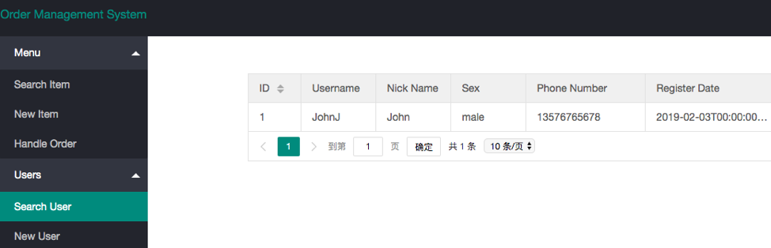

### Food Order System

A simple online ordering system used springboot to build backend service and render on thymeleaf template html file

## Environment

Tool  Version
-
#### JKD  1.8

#### IDE  2019

#### Maven  3.6

#### MySQL  8.0.11

#### Layui  2.5.6

#### Springboot  2.07

#### Running

run SQL file 

execute MainApplication.java

## Project overview

